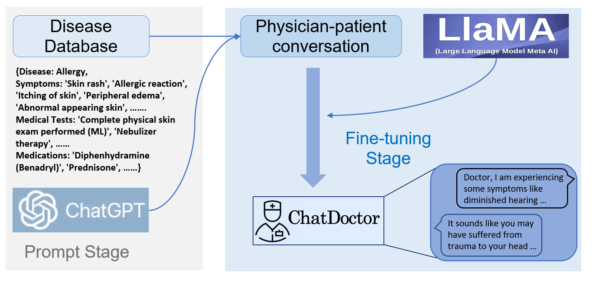
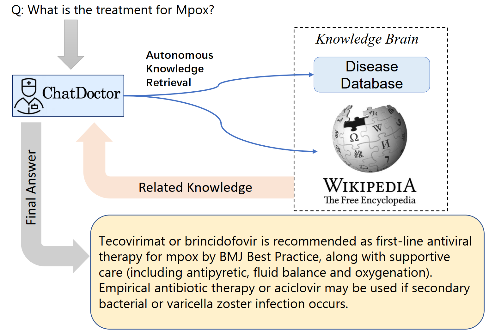

<p align="center" width="80%">

</p>


# [ChatDoctor: A Medical Chat Model Fine-tuned on LLaMA Model using Medical Domain Knowledge](https://arxiv.org/abs/2303.14070)
Yunxiang Li<sup>1</sup>, Zihan Li<sup>2</sup>, Kai Zhang<sup>3</sup>, Ruilong Dan<sup>4</sup>, You Zhang<sup>1</sup>
<h5>1 University of Texas Southwestern Medical Center, Dallas, USA</h5>
<h5>2 University of Illinois at Urbana-Champaign, Urbana, USA</h5>
<h5>3 Ohio State University, Columbus, USA</h5>
<h5>4 Hangzhou Dianzi University, Hangzhou, China</h5>

[](https://github.com/HUANGLIZI/ChatDoctor/blob/main/LICENSE) 
[](https://www.python.org/downloads/release/python-390/) 
[](https://www.yunxiangli.top/ChatDoctor/) 
## Resources List
100k real conversations between patients and doctors from HealthCareMagic.com [HealthCareMagic-100k](https://drive.google.com/file/d/1lyfqIwlLSClhgrCutWuEe_IACNq6XNUt/view?usp=sharing).

Real conversations between patients and doctors from icliniq.com [icliniq-10k](https://drive.google.com/file/d/1ZKbqgYqWc7DJHs3N9TQYQVPdDQmZaClA/view?usp=sharing).

Checkpoints of ChatDoctor, fill this [form](https://forms.office.com/Pages/ResponsePage.aspx?id=lYZBnaxxMUy1ssGWyOw8ij06Cb8qnDJKvu2bVpV1-ANUMDIzWlU0QTUxN0YySFROQk9HMVU0N0xJNC4u).

Stanford Alpaca data for basic conversational capabilities. [Alpaca link](https://github.com/Kent0n-Li/ChatDoctor/blob/main/alpaca_data.json).


<p align="center" width="80%">

</p>

<p align="center" width="80%">

</p>


 ## Setup:
 In a conda env with pytorch available, run:
```
pip install -r requirements.txt
```

 ## Interactive Demo Page:
Demo Page: https://huggingface.co/spaces/ChatDoctor/ChatDoctor
It is worth noting that our model has not yet achieved 100% accurate output, please do not apply it to real clinical scenarios.

For those who want to try the online demo, please register for hugging face and fill out this form [link](https://forms.office.com/Pages/ResponsePage.aspx?id=lYZBnaxxMUy1ssGWyOw8ij06Cb8qnDJKvu2bVpV1-ANURUU0TllBWVVHUjQ1MDJUNldGTTZWV1c5UC4u).

 ## Data and model:
 ### 1. ChatDoctor Dataset:
You can download the following training dataset

100k real conversations between patients and doctors from HealthCareMagic.com [HealthCareMagic-100k](https://drive.google.com/file/d/1lyfqIwlLSClhgrCutWuEe_IACNq6XNUt/view?usp=sharing).

10k real conversations between patients and doctors from icliniq.com [icliniq-10k](https://drive.google.com/file/d/1ZKbqgYqWc7DJHs3N9TQYQVPdDQmZaClA/view?usp=sharing).

5k generated conversations between patients and physicians from ChatGPT [GenMedGPT-5k](https://drive.google.com/file/d/1nDTKZ3wZbZWTkFMBkxlamrzbNz0frugg/view?usp=sharing) and [disease database](https://github.com/Kent0n-Li/ChatDoctor/blob/main/format_dataset.csv). 

Our model was firstly be fine-tuned by Stanford Alpaca's data to have some basic conversational capabilities. [Alpaca link](https://github.com/Kent0n-Li/ChatDoctor/blob/main/alpaca_data.json)

 ### 2. Model Weights:
In order to download the checkpoints, fill this form: [link](https://forms.office.com/Pages/ResponsePage.aspx?id=lYZBnaxxMUy1ssGWyOw8ij06Cb8qnDJKvu2bVpV1-ANUMDIzWlU0QTUxN0YySFROQk9HMVU0N0xJNC4u).
Place the model weights file in the ./pretrained folder.

 ## How to fine-tuning

 ```python
torchrun --nproc_per_node=4 --master_port=<your_random_port> train.py \
    --model_name_or_path <your_path_to_hf_converted_llama_ckpt_and_tokenizer> \
    --data_path ./HealthCareMagic-100k.json \
    --bf16 True \
    --output_dir pretrained \
    --num_train_epochs 1 \
    --per_device_train_batch_size 4 \
    --per_device_eval_batch_size 4 \
    --gradient_accumulation_steps 8 \
    --evaluation_strategy "no" \
    --save_strategy "steps" \
    --save_steps 2000 \
    --save_total_limit 1 \
    --learning_rate 2e-6 \
    --weight_decay 0. \
    --warmup_ratio 0.03 \
    --lr_scheduler_type "cosine" \
    --logging_steps 1 \
    --fsdp "full_shard auto_wrap" \
    --fsdp_transformer_layer_cls_to_wrap 'LLaMADecoderLayer' \
    --tf32 True
 ```
 
 
Fine-tuning with Lora 
```python
WORLD_SIZE=6 CUDA_VISIBLE_DEVICES=0,1,2,3,4,5 torchrun --nproc_per_node=6 --master_port=4567 train_lora.py \
  --base_model './weights-alpaca/' \
  --data_path 'HealthCareMagic-100k.json' \
  --output_dir './lora_models/' \
  --batch_size 32 \
  --micro_batch_size 4 \
  --num_epochs 1 \
  --learning_rate 3e-5 \
  --cutoff_len 256 \
  --val_set_size 120 \
  --adapter_name lora
 ```
 
 ## How to inference
 You can build a ChatDoctor model on your own machine and communicate with it.
 ```python
python chat.py
 ```
 
## Examples:
We fine-tuned our model on HealthCareMagic-100K and GenMedGPT-5k, and test our model on icliniq-15k.

```
Patient question from icliniq-15k: Hi doctor,I am getting one-sided headache. I do not get them often. They are behind my right eye and temple area. Now this time I am also fighting with heavy cold and cough. It came on late morning today and it hurts more when I cough or shake my head or bend over. Prior to this, I had the same headache about four months ago. At that time it came on midafternoon and lasted till next morning. Prior to that, I had the same headache exactly on the right side and lasted for a day. I am on CCB and Protonix. I am scared of brain tumor. Please help

Real doctor answer from icliniq-15k: Hi. Based on what you have told, this is more likely to be due to sinusitis. Sinuses are small air filled cavities in your skull bone. They can get infected and when they are infected, you will get headaches behind eyes. Such headaches will be more common during cold and cough. Brain tumor headache will be on both sides, more in forehead and you will also have vomiting in that case. Based on what you have told, this is more likely due to simple sinus infection instead of brain tumor. CT brain and CT paranasal sinuses.

Answer form ChatGPT: Hello! I'm sorry to hear you're experiencing these headaches. Based on the location of the pain, it sounds like it may be a tension headache or a migraine. These types of headaches can sometimes be triggered by colds or other illnesses. However, it's always best to get checked out by your doctor to rule out any other underlying conditions. In terms of a brain tumor, that is a very rare cause of headaches. Most people who experience headaches do not have a brain tumor. That being said, if you have any concerning symptoms such as vision changes, weakness, or numbness, it is important to seek medical attention right away. In the meantime, you can try taking over-the-counter pain relievers such as ibuprofen or acetaminophen to help with the headache. It's also important to get plenty of rest and stay hydrated. If the headaches persist or become more frequent, please make an appointment with your doctor. Take care!

Answer form ChatDoctor: Hi, Thank you for posting your query. First, I would like to reassure you that there is no need to worry about brain tumor. Also, we should keep migraine apart as well. The most likely cause of your headaches could be sinusitis. This can be confirmed by doing an X-ray of face. Treatment would consist of using decongestant tablets/ nasal sprays. Best wishes, Chat Doctor.
```
ChatDoctor accurately mentions sinusitis, which is also present in the real conversation in icliniq-15k.


## Overview
ChatDoctor is a next-generation AI doctor model that is based on the [LLaMA](https://github.com/facebookresearch/llama) model. The goal of this project is to provide patients with an intelligent and reliable healthcare companion that can answer their medical queries and provide them with personalized medical advice.

The ChatDoctor is an advanced language model that is specifically designed for medical applications. It has been trained on a large corpus of medical literature and has a deep understanding of medical terminology, procedures, and diagnoses. This model serves as the foundation for ChatDoctor, enabling it to analyze patients' symptoms and medical history, provide accurate diagnoses, and suggest appropriate treatment options.

The ChatDoctor model is designed to simulate a conversation between a doctor and a patient, using natural language processing (NLP) and machine learning techniques. Patients can interact with the ChatDoctor model through a chat interface, asking questions about their health, symptoms, or medical conditions. The model will then analyze the input and provide a response that is tailored to the patient's unique situation.

One of the key features of the ChatDoctor model is its ability to learn and adapt over time. As more patients interact with the model, it will continue to refine its responses and improve its accuracy. This means that patients can expect to receive increasingly personalized and accurate medical advice over time.


 

## Abstract
Recent large language models (LLMs) in the general domain, such as ChatGPT, have shown remarkable success in following instructions and producing human-like responses. However, such language models have yet to be adapted for the medical domain, resulting in poor accuracy of responses and an inability to provide sound advice on medical diagnoses, medications, etc. To address this problem, we fine-tuned our ChatDoctor model based on 100k real-world patient-physician conversations from an online medical consultation site. Besides, we add autonomous knowledge retrieval capabilities to our ChatDoctor, for example, Wikipedia or a disease database as a knowledge brain. By fine-tuning the LLMs using these 100k patient-physician conversations, our model showed significant improvements in understanding patients' needs and providing informed advice. The autonomous ChatDoctor model based on Wikipedia and Database Brain can access real-time and authoritative information and answer patient questions based on this information, significantly improving the accuracy of the model's responses, which shows extraordinary potential for the medical field with a low tolerance for error.


 
 ## Introduction
The development of instruction-following large-scale language models (LLMs) such as ChatGPT has gained significant attention due to their remarkable success in instruction understanding and human-like response generation.
These auto-regressive LLMs are pre-trained on web-scale natural language by predicting the next token and then fine-tuned to follow large-scale human instructions.
At the same time, they show robust performance on a wide range of natural language processing (NLP) tasks and generalize to unseen tasks, demonstrating their potential as unified solutions to various problems in natural language understanding, text generation, and conversational artificial intelligence.
However, exploring such generalized domain LLMs in the medical domain remains relatively unexplored \cite{gilson2023does}, despite their great potential to transform medical communication and decision-making.
The reason is that existing models need to learn the medical domain specifically or in detail, resulting in models that often give incorrect medical responses. 

By fine-tuning large linguistic dialogue models on data from doctor-patient conversations, the models' ability to understand patients' needs can be significantly improved. Furthermore, to improve the model's credibility, we also designed a knowledge brain based on Wikipedia and medical-domain databases, which can access real-time and authoritative information and answer patients' questions based on this reliable information, which is vital for the medical field with low error tolerance. Through extensive experiments, we found that the fine-tuned model of doctor-patient dialogue outperforms ChatGPT in terms of precision, recall, and F1. In addition, the autonomous ChatDoctor model can answer the latest medical questions like Mpox. 
Since large language models such as ChatGPT are in a non-open source state, we used Meta's open-source LLaMA. We first trained a generic conversation model using 52K instruction-following data from Stanford University's Alpaca. Then we fine-tuned the model on our collected dataset of doctor-patient conversations.
Our approach has three main contributions: 

1) We designed a framework for fine-tuning large language models in the medical domain.
2) We collected and open-sourced a dataset with 100k patient-physician conversations for fine-tuning the large language model. The dataset contains extensive medical expertise for the medical application of LLMs. 
3) Based on the external knowledge brain, we proposed an autonomous ChatDoctor model with online analysis ability of novel expertise.


 
 ## Patient-physician Conversation Dataset</h2>
The first step in fine-tuning is to collect a dataset of patient-physician conversations. In patient-physician conversations, the patient's descriptions of disease symptoms are often colloquial and cursory. If we manually construct the synthesized patient-physician conversation dataset, it often leads to the problem of insufficient diversity and over-specialized descriptions, which are often spaced out from real scenarios. Collecting real patient-physician conversations is a better solution. Therefore, we collected about 100k real doctor-patient conversations from an online medical consultation website HealthCareMagic(www.healthcaremagic.com). We filtered these data both manually and automatically, removed the identity information of the doctor and patient, and used language tools to correct grammatical errors, and we named this dataset HealthCareMagic-100k. In addition, we collected approximately 10k patient-physician conversations from the online medical consultation website iCliniq to evaluate the performance of our model.


## Autonomous ChatDoctor based on Knowledge Brain</h2>
Equipped with the external knowledge brain, i.e., Wikipedia or our constructed database encompassing over 700 diseases, ChatDoctor could retrieve the corresponding knowledge and reliable sources to answer patients' inquiries more accurately. After constructing the external knowledge brain, we need to let our ChatDoctor retrieve the knowledge he needs autonomously, which can generally be achieved in a large language model by constructing appropriate prompts. To automate this process, we design keyword mining prompts for ChatDoctor to extract key terms for relevant knowledge seeking. Then, the top-ranked relevant passages were retrieved from Knowledge Brain with a term-matching retrieval system. As for the disease database, since the model cannot read all the data at once, we first let the model read the data in batches and select for itself the data entries that might help answer the patient's question. Finally, all the data entries selected by the model are given to the model for a final answer. This approach better ensures that patients receive well-informed and precise responses backed by credible references.


## Limitations
We emphasize that ChatDoctor is for academic research only and any commercial use and clinical use is prohibited. There are three factors in this decision: First, ChatDoctor is based on LLaMA and has a non-commercial license, so we necessarily inherited this decision. Second, our model is not licensed for healthcare-related purposes. Also, we have not designed sufficient security measures, and the current model still does not guarantee the full correctness of medical diagnoses.


## Reference

ChatDoctor: A Medical Chat Model Fine-tuned on LLaMA Model using Medical Domain Knowledge

```
@misc{yunxiang2023chatdoctor,
      title={ChatDoctor: A Medical Chat Model Fine-tuned on LLaMA Model using Medical Domain Knowledge}, 
      author={Li, Yunxiang and Li, Zihan and Zhang, Kai and Dan, Ruilong and Zhang, You},
      year={2023},
      eprint={2303.14070},
      archivePrefix={arXiv},
      primaryClass={cs.CL}
}
```


