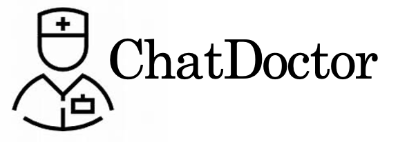

<p align="center" width="80%">

</p>


# ChatDoctor: A Medical Chat Model Fine-tuned on LLaMA Model using Medical Domain Knowledge
[](https://github.com/HUANGLIZI/ChatDoctor/blob/main/LICENSE) 
[](https://www.python.org/downloads/release/python-390/) 

## Overview
ChatDoctor is a next-generation AI doctor model that is based on the [LLaMA](https://github.com/facebookresearch/llama) model. The goal of this project is to provide patients with an intelligent and reliable healthcare companion that can answer their medical queries and provide them with personalized medical advice.

The ChatDoctor is an advanced language model that is specifically designed for medical applications. It has been trained on a large corpus of medical literature and has a deep understanding of medical terminology, procedures, and diagnoses. This model serves as the foundation for ChatDoctor, enabling it to analyze patients' symptoms and medical history, provide accurate diagnoses, and suggest appropriate treatment options.

The ChatDoctor model is designed to simulate a conversation between a doctor and a patient, using natural language processing (NLP) and machine learning techniques. Patients can interact with the ChatDoctor model through a chat interface, asking questions about their health, symptoms, or medical conditions. The model will then analyze the input and provide a response that is tailored to the patient's unique situation.

One of the key features of the ChatDoctor model is its ability to learn and adapt over time. As more patients interact with the model, it will continue to refine its responses and improve its accuracy. This means that patients can expect to receive increasingly personalized and accurate medical advice over time.

## Examples:

Below are some example that describes the medical conversational task. 
 ```
 ### Patient: Doctor, I've been experiencing some symptoms like diminished hearing, facial pain, dizziness, diminished vision, and focal weakness. What could be the possible cause?
 
 ### ChatDoctor:  It sounds like you may have suffered from trauma to your head, which can result in these various symptoms. We will need to run some tests to determine the extent of the injury and how best to treat it.
 
 ### Patient: What medical tests do I need to have?
 
 ### ChatDoctor: We will need to perform a radiographic imaging procedure, hematologic tests, complete blood count, intravenous fluid replacement, X-ray computed tomography scan (CT scan), glucose measurement (glucose level), and a head CT scan to assess the extent of the injury and determine the appropriate treatment plan.
 
 ### Patient: Do you have any recommendations for medications?
 
 ### ChatDoctor: Yes, we will prescribe propofol to help you sleep through the procedures, midazolam (Versed) to help relax you, and meperidine (Demerol) to manage your pain. We will also administer sodium bicarbonate to maintain your body pH levels and aminophylline to counteract any respiratory issues caused by the sedatives.
 ```
 
 ## Setup:
 In a conda env with pytorch available, run:
```
pip install -r requirements.txt
```

 ## Interactive Demo Page:
We are developing the Demo Page and it is coming soon!

 ## Data and model:
 ### 1. ChatDoctor Medical Corpus:
You can download the following medical corpus:
ChatDoctor Medical Corpus Version 1.0: [link](https://drive.google.com/file/d/1pMH0ttKWv4KfEOXBc5hTCKshV8f51KBa/view?usp=sharing)
 
 ### 2. Model Weights:
You can download the following model weights:
ChatDoctor Version 1.0: [link](https://drive.google.com/drive/folders/1U4McOkZ-YFeaJaTnDokU625BncaTeL0R?usp=share_link)

 ### 3. Model Preparation:
Download the [ChatDoctor Version 1.0](https://drive.google.com/drive/folders/1U4McOkZ-YFeaJaTnDokU625BncaTeL0R?usp=share_link) model weights and place the weights file in the ./result folder.

 ## How to fine-tuning
 It is coming soon!
 
 ## How to inference
 You can build a ChatDoctor model on your own machine and communicate with it.
 ```python
python chat.py
 ```

## Reference

ChatDoctor: A Medical Chat Model Fine-tuned on LLaMA Model using Medical Domain Knowledge

```
@misc{ChatDoctor,
  title={ChatDoctor: A Medical Chat Model Fine-tuned on LLaMA Model using Medical Domain Knowledge},
  author={Li, Yunxiang and Li, Zihan and Zhang, Kai and Dan, Ruilong and Dohopolski, Michael and Zhang, You},
  publisher = {GitHub},
  journal = {GitHub repository},
  year={2023}
}
```
